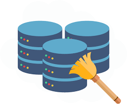

# Dirty Data Project

## Project description

This project is an individual project assigned during the CodeClan _Professional Data Analysis_ Course.

One of the most common sayings you will likely hear for anyone working as a data analyst/scientist ‘80% of your time is data cleaning’ - this can include (but is not limited to!) loading all your data in to a single tool for analysis; dealing with missing values; duplicates and outliers; cleaning strings; reshaping and joining.

__Goal of this project task is to clean and analyse multiple raw "dirty" datasets in order to answer several questions regarding the data.__

## Brief overview and information about the data

This project consists of multiple individual tasks. Each task is based on unique data(sets), which are cleaned and analysed to answer the data-specific questions through steps of: data exploration, data cleaning, reshaping, joining and data analysis.

The project tasks are organised within each their individual folder:

  __1. [Seabird Observations](/sea_bird_observation)__
  
The raw data contains seabird observations/sightings as done from ships in seas around New Zealand. 
The data was recorded using guidelines for the Australasian Seabird Mapping Scheme and counts seabirds seen from a ship during a 10 minute period. The data includes geolocations of the sightings, bird species, numbers and behaviour, observer and ship name, and observation date and time.

It has been built from data elements extracted by Te Papa staff from the at-sea bird observations recorded in the logbooks of Captain John Arthur Francis Jenkins (1928-1989) and count cards held by the convenor of the Australasian Seabird Mapping Scheme.

The logbooks of Captain Jenkins are held by the Archives of the Auckland War Memorial Museum.
Source: Te Papa and licensed by Te Papa for re-use under the Creative Commons BY 4.0 International licence
<https://www.tepapa.govt.nz/learn/research/datasets/sea-observations-seabirds-dataset>

  __2. [Halloween Candy](/halloween_candy)__
  
The raw data contains results from a questionnaire regarding halloween/trick or treat candy. The data is open-access and available here: <https://www.scq.ubc.ca/so-much-candy-data-seriously/>
The questionnaires are taken in three consecutive years (2015, 2016, 2017), and the results can be found in three separate .xlsx files.

  __3. [Right Wing Authoritarianism](/additional_tasks_extensions/right_wing_authoritarianism)__
  
The raw data contains the results from a questionnaire regarding right wing authoritarianism preferences among respondents. The data, including more information, can be found here <https://openpsychometrics.org/_rawdata/>
This task is not completely finalised.

## Folder structure

Each project task, as outlined above, is organised within individual folders. They contain:

  * `README` files, for each individual project task including more information, cleaning and analysis steps:
    - [Seabird Observations README](/sea_bird_observation/README_analyses_overview.Rmd)
    - [Halloween Candy README](/halloween_candy/documentation_and_analysis/analysing_candy.Rmd)
  * `raw_data` folder, containing the raw datafiles
  * `data_cleaning_scripts` folder, containing the R script (including commentary) on cleaning and data wrangling steps
  * `clean_data` folder, containing the cleaned data files in CSV format
  * `documentation_and_analysis` folder, containing the R notebooks with data analysis steps (including commentary) and answers to the research/business questions:
    - [Seabird Observations analysis](/sea_bird_observation/documentation_and_analysis)
    - [Halloween Candy analysis](/halloween_candy/documentation_and_analysis)
    - [Right Wing Authoritarianism](/additional_tasks_extensions/right_wing_authoritarianism/analysis_and_documentation)
  

## Analytical tools, software and packages used

  * The code is written in R (version 4.3.0)
    R Core Team (2023). _R: A Language and Environment for Statistical Computing_. 
    R Foundation for Statistical Computing, Vienna, Austria.
   <https://www.R-project.org/>

  * R is run in Rstudio 2023.03.0+386
  
  * The following libraries are used/required:
    - `tidyverse`(ver 2.0.0)
    - `readxl` (ver 1.4.2)
    - `janitor` (ver 2.2.0)
    

